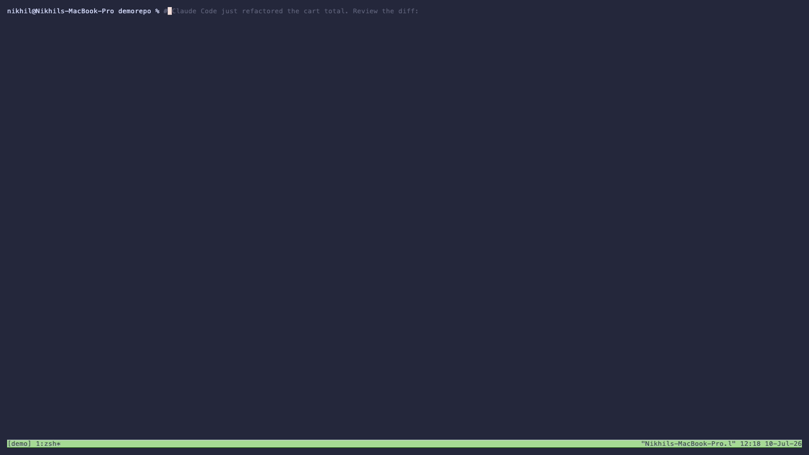

# tmux-slopchop-cc

A keyboard-driven terminal **diff-review TUI for [Claude Code](https://claude.com/claude-code)**.

Pop a review overlay over your Claude Code pane, walk the diff, annotate lines with
**FIX** / **DISCUSS**, and on submit the built prompt is **staged into Claude Code's
input** via tmux — pasted, not sent, so you review it and press Enter yourself.

> A standalone fork of [`pi-slopchop`](https://github.com/robzolkos/pi-slopchop) by
> Rob Zolkos. Same review UI; the backend was swapped from the Pi agent's editor to a
> tmux paste bridge so it works with Claude Code. See [Attribution](#attribution).



## Why
Claude Code is great at *doing* work but reviewing its diff in a chat scrollback is
clunky. This gives you a real review surface: navigate by hunk, drop line-anchored
questions/change-requests, and fire them back to Claude in one keystroke — all in the
terminal, no browser, on your existing Claude Code session.

## Requirements
- Node.js ≥ 18
- tmux
- [Claude Code](https://claude.com/claude-code) (or any CLI you drive from a tmux pane)

## Install
```bash
git clone https://github.com/nikhilmehta16/tmux-slopchop-cc.git
cd tmux-slopchop-cc
npm install
npm run build
npm link          # puts the `slopchop-cc` command on your PATH
```

## tmux setup
Add this to `~/.tmux.conf`, then reload (`tmux source-file ~/.tmux.conf`):

```tmux
# prefix + r  ->  review overlay over the current pane; submit stages the prompt into it.
# A popup's -E command can't expand #{pane_id} (no pane context inside the popup), so
# run-shell (which can) stashes the caller's pane id in a global env var that the popup
# inherits, and slopchop-cc reads it as the paste target.
bind r run-shell "tmux set-environment -g SLOPCHOP_TARGET '#{pane_id}'" \; \
  display-popup -d '#{pane_current_path}' -w 90% -h 90% -E \
  "slopchop-cc || { printf '\n[slopchop-cc] nothing to review (no git changes) — press Enter'; read _; }"
```

## Use
1. Run Claude Code inside a tmux pane.
2. Press **`prefix + r`** — the review overlay floats over the pane.
3. `1`/`2`/`3` pick scope (uncommitted / last commit / branch); `Tab` to the **Diff** pane.
4. `j`/`k` move, `n`/`p` jump hunks; **`f`** = FIX, **`d`** = DISCUSS on the selected line.
5. **`s`** submits — the popup closes and the prompt is staged in Claude Code's input.
   Read it, press Enter to send.

FIX asks Claude to make the change; DISCUSS asks it to explain/justify without editing.

## Keys
`1/2/3` scope · `Tab` focus · `/` search · `j/k` move · `n/p` hunk · `f` FIX ·
`d`/`c` DISCUSS · `l` file comment · `a` whole-change note · `t` templates ·
`v` unified/side-by-side · `u` toggle unchanged · `s` submit · `Esc` exit.

## CLI (without the popup)
```bash
slopchop-cc --target <tmux-pane-id>   # stage into that pane (bracketed paste, no Enter)
slopchop-cc --clipboard               # copy the prompt to the clipboard
slopchop-cc                           # print the prompt to stdout
```
Inside the tmux popup, the target pane is read from the `SLOPCHOP_TARGET` env var the
binding sets, so no `--target` is needed there.

## How the tmux handoff works
`tmux load-buffer` + `paste-buffer -p` (bracketed paste) drops the prompt into the
target pane as a single input without a trailing newline — so it lands staged in
Claude Code's prompt rather than executing. You stay in control of when it's sent.

## Known limitations (v0.1)
- **No syntax token highlighting yet** — diff add/remove backgrounds work, but code
  isn't token-colored (the original relied on a Pi-internal highlighter).
- macOS clipboard fallback uses `pbcopy`.

## Attribution
This is a fork of **[pi-slopchop](https://github.com/robzolkos/pi-slopchop)** by
**Rob Zolkos** (MIT), which was itself inspired by
[pi-diff-review](https://github.com/badlogic/pi-diff-review) by Mario Zechner.
The review TUI, diff parsing, annotation model, and prompt composition are reused
from pi-slopchop; this fork replaces the Pi-agent backend with a standalone launcher
and a tmux paste bridge targeting Claude Code. Licensed MIT — see [LICENSE](LICENSE).
